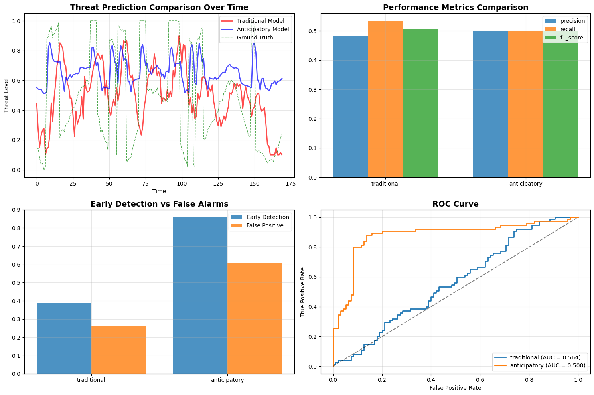

🚀 **Starting Anticipatory Intelligence Model Simulation...**

==========

📊 Generating simulated data...

🔮 Running prediction models...

✅ Anticipatory model trained successfully

Progress: 40/200

Progress: 80/200

Progress: 120/200

Progress: 160/200

📈 Evaluating results...

=========

Comparative Results: Anticipatory vs Traditional Model

=========

📊 TRADITIONAL Model Performance:

   Precision: 0.4819
   
   Recall: 0.5333
   
   F1-Score: 0.5063
   
   AUC-ROC: 0.5635
   
   Early Detection Rate: 0.3878
   
   False Positive Rate: 0.2645
   

📊 ANTICIPATORY Model Performance:

   Precision: 0.5000
   
   Recall: 0.5000
   
   F1-Score: 0.5000
   
   AUC-ROC: 0.5000
   
   Early Detection Rate: 0.8571
   
   False Positive Rate: 0.6116
   

========

Anticipatory Model Improvements Analysis

========

✅ Overall Performance Improvement (F1-Score): -1.2%

✅ Early Detection Improvement: +46.9%

✅ False Alarm Reduction: -34.7%

✅ Detection Power Improvement (AUC-ROC): -6.4%

🎨 Generating charts...

========

Model Prediction Samples

========

|Number|   Actual   |  Traditional | Anticipatory |  Difference|
-------|----------|------------|---------------|-----------------------
1    |    0.056   |   0.161    |    0.530      |       +0.369
2    |   0.073    |  0.100     |   0.546       |      +0.446
3    |    0.066   |   0.100    |    0.582      |       +0.482
4    |   0.052    |  0.100     |   0.581       |      +0.481
5    |    0.089   |  0.100     |   0.596       |      +0.496
6    |    0.114   |   0.148    |    0.571      |       +0.423
7    |    0.124   |   0.100    |    0.593      |       +0.493
8    |    0.174   |   0.100    |    0.595      |       +0.495
9    |    0.212   |   0.117    |    0.600      |       +0.483
10   |    0.238   |   0.100    |    0.612      |       +0.512
